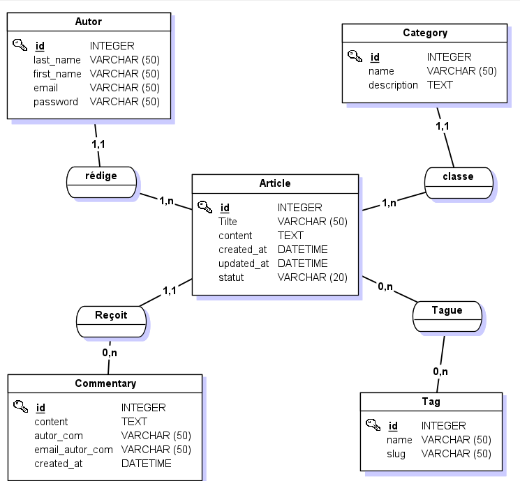
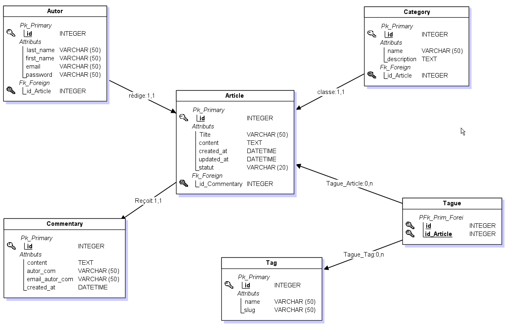

# Blog Node.js

Blog réalisé avec Node.js, Express, EJS et MySQL.

## Lancer le projet

```bash
npm install
node app.js
```

Le site est accessible sur http://localhost:3000

## Base de données

### MCD (Modèle Conceptuel de Données)



### MLD (Modèle Logique de Données)


